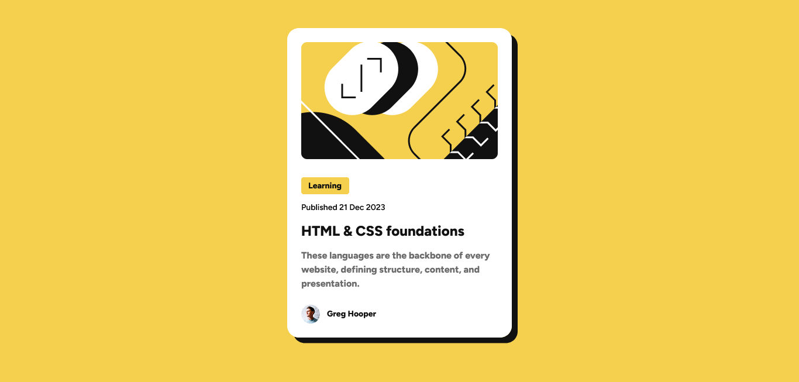

# Frontend Mentor - Blog preview card solution

This is a solution to the [Blog preview card challenge on Frontend Mentor](https://www.frontendmentor.io/challenges/blog-preview-card-ckPaj01IcS). Frontend Mentor challenges help you improve your coding skills by building realistic projects.

## Table of contents

- [Overview](#overview)
  - [The challenge](#the-challenge)
  - [Screenshots](#screenshots)
  - [Links](#-links)
- [My process](#my-process)
  - [Built with](#built-with)
  - [What I learned](#what-i-learned)
  - [Continued development](#continued-development)
- [Authors](#authors)

## Overview

### The challenge

Users should be able to:

- See hover and focus states for all interactive elements on the page
## Screenshots




## 🔗 Links

- Solution URL: [https://github.com/FYLIPI-2004/Blog_Preview_Card](https://github.com/FYLIPI-2004/Blog_Preview_Card)
- Live Site URL: [https://fylipi-2004.github.io/Blog_Preview_Card/](https://fylipi-2004.github.io/Blog_Preview_Card/)

## My process

### Built with

- Semantic HTML5 markup
- CSS custom properties
- Flexbox
- CSS Grid

### What I learned

This is the code i've made for the white background and i've added the shadow too!

```
.container {
  box-sizing: border-box;
  width: 384px;
  padding: 24px;
  background-color: #FFFFFF;
  border-radius: 20px;
  margin: 48px auto 28px;
  box-shadow: 10px 10px #111111;
}
```

I've had to creat the "learning" background and make sure it's the right size. So i used the ```background-clip: border-box``` to make it the cut i needed.

```
.fundo {
  & p {
    background-clip: border-box;
    margin-right: 254px;
    padding: 4px 12px;
    font: var(--text-bold);
    border-radius: 4px;
    background-color: var(--yellow);
  }
}
```


### Continued development

I have a problem with nesting css, so i wan't to learn more about it, to make my code more optimized and simple.
## Authors

- [@FYLIPI-2004](https://github.com/FYLIPI-2004)
- Frontend Mentor - [@FYLIPI-2004](https://www.frontendmentor.io/profile/FYLIPI-2004)
